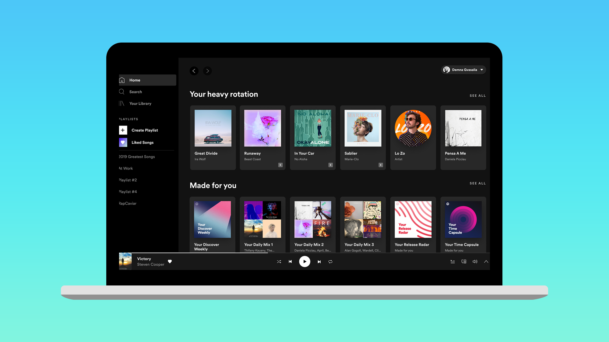
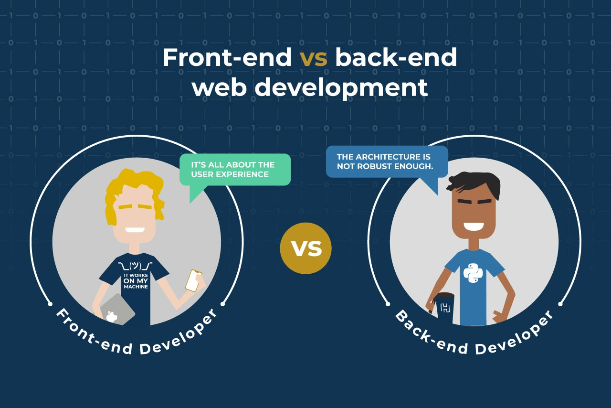

# Web Application Development for Industrial Engineers

## การพัฒนาเวปแอปพลิเคชันสำหรับวิศวกรอุตสาหการ

---

# General Details

- **รหัสกระบวนวิชา**: วศ.อ. 499 (255499)
- **ภาคการศึกษา**: 2564-2
- **ชื่อกระบวนวิชา**:
  - หัวข้อพิเศษสำหรับสาขาวิชาวิศวกรรมอุตสาหการ 2
  - Special Topics in Industrial Engineering 2
- **อาจารย์**: ผศ.ดร.นิรันดร์ พิสุทธอานนท์

---

# After this class you will be able to

- มีความเข้าใจพื้นฐานในในเวปเทคโนโลยีดังเช่น
  - HTML, CSS, JavaScript, React JS Framework และ Google Firestore Database
- สามารถสร้างแอปพลิเคชันบนเวปที่เก็บข้อมูลนำเข้าจากผู้ใช้
  - โดยใช้ HTML, CSS และ JavaScript
- สามารถสร้างแอปพลิเคชันบนเวปที่เก็บข้อมูลนำเข้าจากผู้ใช้และเก็บข้อมูลในฐานข้อมูล
  - โดยใช้ React JS Framework และ Google Firestore Database

---

# Why

ในปัจจุบันอุตสาหกรรมต่างๆได้มีการเชื่อมต่อกับเทคโนโลยีดิจิตอลมากขึ้น ทำให้เกิดความจำเป็นในการสร้างซอฟต์แวร์เพื่อมาจัดการข้อมูล ไม่ว่าจะเป็นซอฟต์แวร์สำหรับผู้ใช้งานหรือซอฟต์แวร์ที่อยู่บนเซิร์ฟเวอร์ ซึ่งความแพร่หลายของเทคโนโลยีดิจิตอลในอุตสาหกรรมนี้ ทำให้ความสามารถในการสร้างซอฟต์แวร์และการเข้าใจในระบบการทำงานของซอฟต์แวร์ เป็นสิ่งที่มีค่าและเป็นแต้มต่อสำหรับผู้ที่เกี่ยวข้องกับการจัดการระบบอุตสาหกรรมอย่างเช่นวิศวะกรอุสาหการ

วิชานี้ถูกออกแบบมาเพื่อให้นักศึกษามีความเข้าใจในระบบของซอฟต์แวร์และมีความสามารถในการสร้างซอฟต์แวร์สำหรับการจัดการได้ โดยวิชานี้จะใช้เทคโนโลยี Web Application ซึ่งเป็นเทคโนโลยีที่มีความนิยมเป็นอย่างมาก เนื่องจากความสามารถในการเข้าถึง Internet จากหลากหลายอุปกรณ์ ไม่ว่าจะเป็น คอมพิวเตอร์ แทปเล็ต หรือโทรศัพท์มือถือ ทำให้ซอฟต์แวร์ที่ถูกสร้างด้วยเทคโนโลยี Web Application นี้ สามารถเข้าถึงกลุ่มผู้ใช้ที่หลากหลายและกว้างขวาง

---

# Actually, this is why

- [เปิดโผฐานเงินเดือนปี 2020 “โปรแกรมเมอร์” ดาวรุ่ง เด็กจบใหม่สตาร์ทสูงสุดแตะ 40,000 บาท!](https://positioningmag.com/1264024)
- [ไอที ครองแชมป์ เงินเดือนเด็กจบใหม่ สตาร์ตสูงสุด 60,000 บาท](https://www.sentangsedtee.com/today-news/article_171789)

---

> "โดยส่วนใหญ่แล้วเด็กจบใหม่ที่ได้รับเงินเดือนสูงมักเป็นเด็กจบใหม่ที่มีประสบการณ์การทำงานมาก่อน เคยรับงาน Freelance หรือทำงาน Startup ตั้งแต่ยังไม่จบการศึกษา มีทักษะการเขียนโปรแกรมเฉพาะทาง หรือมีความชำนาญในการเขียนโปรแกรมหลากหลายภาษา"
> --[Source](https://www.sentangsedtee.com/today-news/article_171789)

---

# แผนการประเมินการเรียนรู้

| วิธีการประเมินผลการเรียนรู้ | สัดส่วนของการประเมิน |
| :-------------------------: | :------------------: |
|        การสอบกลางภาค        |         20%          |
|        การสอบปลายภาค        |         20%          |
|  การประเมินเวปแอปพลิเคชัน   |         30%          |
|  การประเมินเวปแอปพลิเคชัน   |         30%          |

---

# แผนการสอน

- Midterm
  - HTML, CSS, JavaScript
  - "Todo App"
- Final
  - React JS, Google Firebase
  - Project

---

# Software

- Applications that runs on top of an operating system
  - Windows, MacOS, Linux, Android, iOS
- "Talk" to OSs directly.
- Cannot be used between operation systems.
- Use different technologies/languages
  - C# (Windows), Swift (MacOS, iOS), Kotlin (Android), C++ (Linux)

---

# Web Application

- Applications that execute on a browser (another application) that runs on top of an operating system.
- Does not "talk" to the system directly.
- _Cross platform_
  - "Write once, use anywhere"
- Use similar technogoies/languages
  - HTML, CSS, JavaScript

---

# Types of "Web" Developers

- Front End
- Back End
- Dev Ops
- Full Stack

---

# Web Developer Roadmap

[Do not panic!](https://github.com/kamranahmedse/developer-roadmap)

---

# Lets get started

---

# Tools

- Web browser
  - Chrome
- Integrated development environment (IDE)
  - VS Code
- _Let's go_
