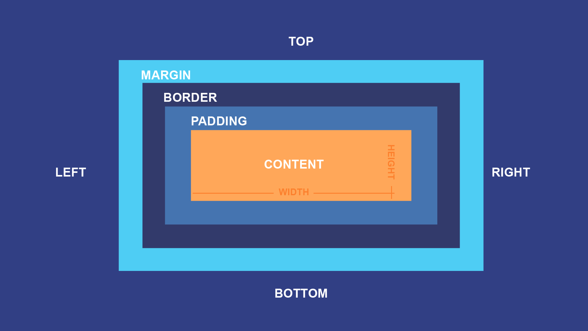
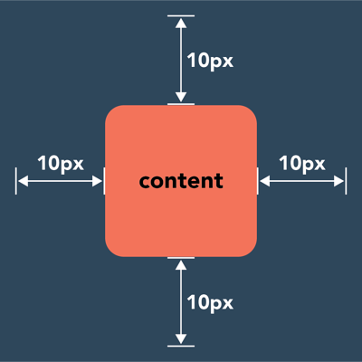
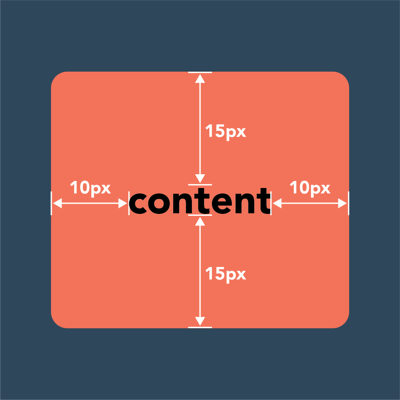
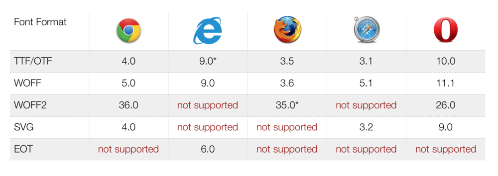
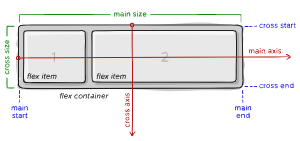

<style>
@import url('https://fonts.googleapis.com/css2?family=Prompt:ital,wght@0,100;0,300;0,400;0,700;1,100;1,300;1,400;1,700&display=swap');

:root {
    font-family: Prompt;
    --hl-color: #D57E7E;
}

h1 {
  font-family: Prompt;
}
</style>

# Web Application Development for Industrial Engineers

## การพัฒนาเวปแอปพลิเคชันสำหรับวิศวกรอุตสาหการ

---

# Box Model



---

# Margin

- Margin is the space around an element’s border.



---

# Padding

- Padding is the space between an element’s border and the element’s content.



---

# Margin and Padding

- https://codepen.io/nnnpooh/pen/KKvLggx

---

# Border

- A box that surrounds an HTML element's padding.
- https://codepen.io/nnnpooh/pen/QWMPaRX

---

# CSS Unit

|  Data type   |          Description           |
| :----------: | :----------------------------: |
|   `number`   | `1024`, `-55`, `0.255`, `-1.2` |
| `dimension`  |  `45deg`, `150ms`, or `10px`   |
| `percentage` |             `50%`              |

---

# Absolute Unit Lenght

|                      Unit                      |        Name         |      Equivalent to       |
| :--------------------------------------------: | :-----------------: | :----------------------: |
| <span style="color: var(--hl-color)">px</span> |       Pixels        |   1px = 1/96th of 1in    |
| <span style="color: var(--hl-color)">in</span> |       Inches        |   1in = 2.54cm = 96px    |
|                       cm                       |     Centimeters     | 1cm = 37.8px = 25.2/64in |
|                       mm                       |     Millimeters     |   1mm = 1/10th of 1cm    |
|                       Q                        | Quarter-millimeters |    1Q = 1/40th of 1cm    |
|                       pc                       |        Picas        |    1pc = 1/6th of 1in    |
|                       pt                       |       Points        |   1pt = 1/72th of 1in    |

---

# Relative Unit Length

| Unit                                            | Relative to                                                |
| ----------------------------------------------- | ---------------------------------------------------------- |
| <span style="color: var(--hl-color)">em</span>  | Font size of the parent (`font-size`) or itself (`width`). |
| <span style="color: var(--hl-color)">rem</span> | Font size of the root element.                             |
| vw                                              | 1% of the viewport's width.                                |
| vh                                              | 1% of the viewport's height.                               |
| vmin                                            | 1% of the viewport's smaller dimension.                    |
| vmax                                            | 1% of the viewport's larger dimension.                     |

[more here...](https://developer.mozilla.org/en-US/docs/Learn/CSS/Building_blocks/Values_and_units)

---

# `em` vs `rem` (Typography)

- For `font-size`, use `rem`.
- https://codepen.io/nnnpooh/pen/gOxEzzd

---

# `em` vs `rem` (Width/Height)

- For `width` and `height` (and ...), use `em`.
- https://codepen.io/nnnpooh/pen/eYEXrjZ

---

# Font Format

- TrueType Font (TTF)
  - Old standard
- OpenType (OTF)
  - Upgrade from TTF
- Embedded Open Type (EOT)
  - Not much browser support
- Web Open Font Format (WOFF/WOFF2)
  - Use this.
- Scalable Vector Graphics font (SVG)
  - iPhone and iPad

---

# Browser Support



- [Source](https://medium.com/@aitareydesign/understanding-of-font-formats-ttf-otf-woff-eot-svg-e55e00a1ef2)
- [Can I use?](https://caniuse.com/)

---

# Font Weight

| Value | Common weight name        |
| ----- | ------------------------- |
| 100   | Thin (Hairline)           |
| 200   | Extra Light (Ultra Light) |
| 300   | Light                     |
| 400   | Normal (Regular)          |

---

# Font Weight (Cont.)

| Value | Common weight name      |
| ----- | ----------------------- |
| 500   | Medium                  |
| 600   | Semi Bold (Demi Bold)   |
| 700   | Bold                    |
| 800   | Extra Bold (Ultra Bold) |
| 900   | Black (Heavy)           |

---

# How to include Local font

- Download google font - [Mali](https://fonts.google.com/specimen/Mali)
- Extract and copy font files (TTF) into local folders.
- Use the `@font-face` rule
  - (`@` means special instructions for the browser, not directly related to styling.)

---

```css
@font-face {
  font-family: myLocalFont;
  src: url(./font/Mali-Regular.ttf);
  font-weight: normal;
  font-style: normal;
}

@font-face {
  font-family: myLocalFont;
  src: url(./font/Mali-Bold.ttf);
  font-weight: bold;
  font-style: normal;
}
```

- Note that event if you don't have the rule for `bold`, you can still see bold font. This 'bolding' is done by browser (see [faux bold](https://alistapart.com/article/say-no-to-faux-bold/)).

---

# Hosted font

- [Chakra Petch](https://fonts.google.com/specimen/Chakra+Petch)
- Choose `Regular 400` and `Bold 700`
- Add `@import`
  - Add another css into the current sheet

```css
@import url("https://fonts.googleapis.com/css2?family=Chakra+Petch:wght@400;700&display=swap");
```

---

# Custom Properties

- Declare custom properties at the `:root` pseudo-class. For a HTML document, this is `<html>`

```css
:root {
  --main-bg-color: brown;
}
```

- To use the property, do the following.

```css
element {
  background-color: var(--main-bg-color);
}
```

---

# Layout

- Block
- Inline-block
- Flex
- Grid
- Float

---

# Block vs Inline

- `block` elements appear one below the other
- `inline` elements appear beside one another like the individual words in a paragraph.
- https://codepen.io/nnnpooh/pen/dyzLovq

---

# Block and Inline - Margin and Padding

- Block elements
  - Can add margins and padding on all four sides.
- Inline elements
  - Can add space to the left and right.
  - **Cannot** add height to the top or bottom padding or margin.
- https://codepen.io/nnnpooh/pen/bGrJgMo

---

# Inline vs Inline-Block

- `inline-block` allows one to set a width and height on the element.

  - The top and bottom margins/paddings are respected, but with `display: inline` they are not.

- https://codepen.io/nnnpooh/pen/zYdXGwE

---

# Flex

- Lay things out in one dimension
  - Either as a row or as a column
- https://codepen.io/nnnpooh/pen/ExvJjMR
- Alos, see this [guide](https://css-tricks.com/snippets/css/a-guide-to-flexbox/).

  

---

# Grid

- Grid Layout is designed for two dimensions — lining things up in rows and columns.
- https://codepen.io/nnnpooh/pen/wvqZWQP
- Also, see this [guide](https://css-tricks.com/snippets/css/complete-guide-grid/).

---

# Float

- Floating an element changes the behavior of that element and the block level elements that follow it in normal flow.
- The floated element is moved to the left or right and removed from normal flow, and the surrounding content floats around it.
- https://codepen.io/nnnpooh/pen/porBarb

---

# Positioning

- Static
- Relative
- Absolute
- Fixed
- Sticky

---

# Static

- The element is positioned according to the normal flow of the document.
- The `top`, `right`, `bottom`, `left`, and `z-index` properties have no effect.
- This is the default value.

---

# Relative

- The element is positioned according to the normal flow of the document
  - then offset relative to itself based on the values of `top`, `right`, `bottom`, and `left`.
- The offset does not affect the position of any other elements.
- https://codepen.io/nnnpooh/pen/VwzNYNX

---

# Absolute

- The element is removed from the normal document flow.
- It is positioned relative to its closest `relative` ancestor.
  - Its final position is determined by the values of `top`, `right`, `bottom`, and `left`.
- https://codepen.io/nnnpooh/pen/bGrJNPy

---

# Fixed

- It is positioned relative to the initial containing block established by the viewport
  - Except when one of its ancestors has a transform, perspective, or filter property set to something other than `none`.
- Its final position is determined by the values of `top`, `right`, `bottom`, and `left`.
- https://codepen.io/nnnpooh/pen/wvqZBVb

---

# Sticky

- Sticky positioning is a hybrid of relative and fixed positioning.
- The element is treated as `relative` positioned until it crosses a specified threshold, at which point it is treated as `fixed` positioned.
- https://codepen.io/nnnpooh/pen/GRvLQXb

---

# Responsive design

- Flex: https://codepen.io/nnnpooh/pen/dyzEpyY
- Media query: https://codepen.io/nnnpooh/pen/XWaQZvE

---

# Media query

- Media types
  - `all`, `print`, `screen`, `speech`
- Logical operators
  `not`, `and`, `only`
- Examples
  - `@media print { ... }`
  - `@media (hover: hover) { ... }`
  - `@media (max-width: 12450px) { ... }`
  - `@media (min-width: 30em) and (orientation: landscape) { ... }`
