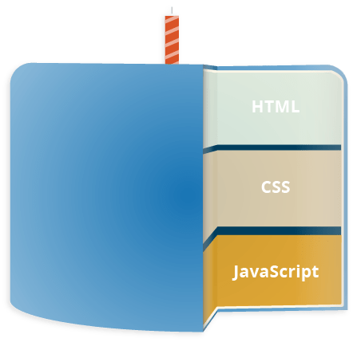

<style>
@import url('https://fonts.googleapis.com/css2?family=Prompt:ital,wght@0,100;0,300;0,400;0,700;1,100;1,300;1,400;1,700&display=swap');

:root {
    font-family: Prompt;
    --hl-color: #D57E7E;
}

h1 {
  font-family: Prompt;
}
</style>

# Web Application Development for Industrial Engineers

## การพัฒนาเวปแอปพลิเคชันสำหรับวิศวกรอุตสาหการ

---

# JavaScript

- JavaScript is a scripting or programming language
- Allows implementation of complex features on web pages.
  - Content updates
  - Animation
  - Interactive maps
  - Audio/video contents

---

# 3 Layers in Web Technology

- `HTML`: markup language
  - Defining structure
- `CSS`: stylesheet language
  - Apply styling to HTML content
- `JavaScript`: scripting language
  - Add dynamics to content



---

# HTML

```html
<p>Player 1: Chris</p>
```

---

# CSS

```css
p {
  font-family: 'helvetica neue', helvetica, sans-serif;
  letter-spacing: 1px;
  text-transform: uppercase;
  text-align: center;
  border: 2px solid rgba(0, 0, 200, 0.6);
  background: rgba(0, 0, 200, 0.3);
  color: rgba(0, 0, 200, 0.6);
  box-shadow: 1px 1px 2px rgba(0, 0, 200, 0.4);
  border-radius: 10px;
  padding: 3px 10px;
  display: inline-block;
  cursor: pointer;
}
```

---

# JavaScript

```javascript
const para = document.querySelector('p');

para.addEventListener('click', updateName);

function updateName() {
  let name = prompt('Enter a new name');
  para.textContent = 'Player 1: ' + name;
}
```

- https://codepen.io/nnnpooh/pen/poWopXd

---

# What just happened?

JavaScript allows

- Storing value inside a variable (user input).
- Performing operations on variables (joining text).
- Running code in response to certain `events` occurring on a web page (click event).
- Updating content shown in the page.

---

# Application Programming Interfaces (APIs)

- Extra functionality on top of client-side JavaScript language.
- APIs are ready-made sets of code building blocks for developers.

---

# Types of APIs

- Browser APIs
  - Functionalities built into web browsers
- Third Parties APIs
  - Functionalities built by vendors

---

# Browser APIs

- `DOM` (Document Object Model) API
  - Allows manipulation of HTML and CSS.
- `Geolocation` API
  - Retrieves geographical information.
- `Canvas` and `WebGL`
  - Allows creation of animated 2D and 3D graphics.
- `Audio` and `Video` APIs
  - Enables multimedia.

---

# Third Parties APIs

- [Line APIs](https://developers.line.biz/en/)
- [Facebook APIs](https://developers.facebook.com/)

---

# Add JavaScript to the page

- Inline
- External file

---

# Inline

HTML

```html
<head>
  <script>
    //   JavaScript goes here
  </script>
</head>
<body>
  <button>Click me</button>
</body>
```

---

# Inline

JavaScript

```javascript
document.addEventListener('DOMContentLoaded', function () {
  function createParagraph() {
    let para = document.createElement('p');
    para.textContent = 'You clicked the button!';
    document.body.appendChild(para);
  }

  const buttons = document.querySelectorAll('button');

  for (let i = 0; i < buttons.length; i++) {
    buttons[i].addEventListener('click', createParagraph);
  }
});
```

---

# External file

- Create an `index.html` file with `<button>Click me</button>`
- Add `<script src="script.js" defer></script>` in `header` tag.
- Create `script.js`

---

# External file (cont.)

- Add

```javascript
function createParagraph() {
  let para = document.createElement('p');
  para.textContent = 'You clicked the button!';
  document.body.appendChild(para);
}

const buttons = document.querySelectorAll('button');

for (let i = 0; i < buttons.length; i++) {
  buttons[i].addEventListener('click', createParagraph);
}
```

---

# Script loading strategies

- All the HTML on a page is loaded in the order in which it appears.
- Sometimes, your code won't work if the JavaScript is loaded and parsed _before_ the HTML you are trying to do something to.

---

# Inline Script

- For the inline example, the loading is done through

```javascript
document.addEventListener("DOMContentLoaded", function() {
  ...
});
```

- This is an `event listener`, which listens for the browser's `DOMContentLoaded` event.
- The JavaScript inside this block will not run until all html content is loaded.

---

# External file

- In the external example, the `defer` attribute tells the browser to continue downloading the HTML content once the `<script>` tag element has been reached.

```javascript
<script src='script.js' defer></script>
```

- The code in `script.js` will not run until all html content is loaded.

---

# Comment

- Single line

```javascript
// I am a comment
```

- Multi-line

```javascript
/*
  I am also
  a comment
*/
```
