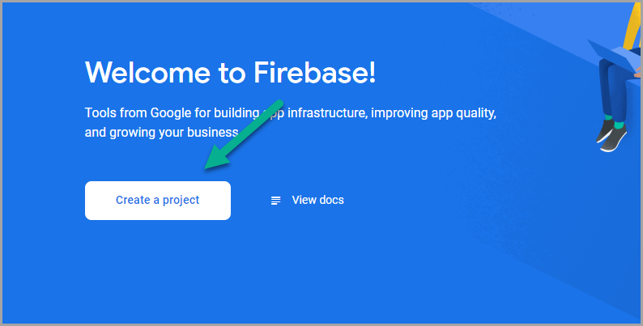
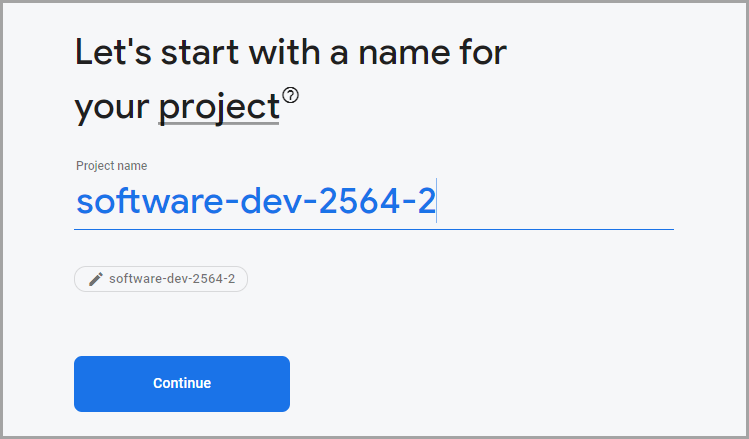
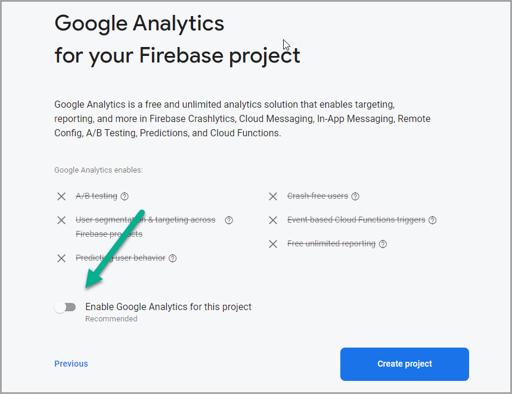
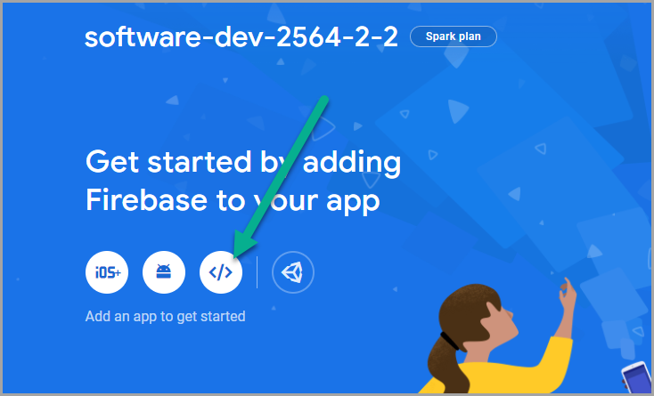
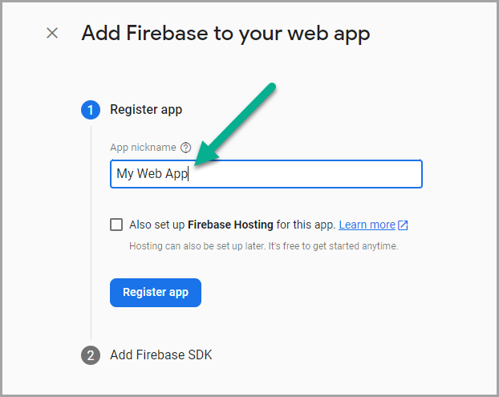
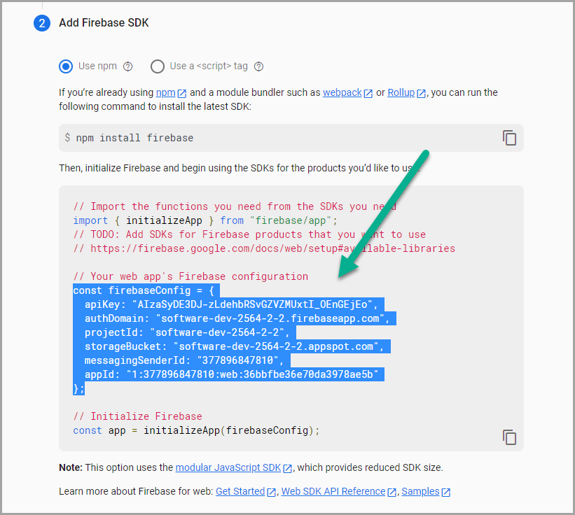
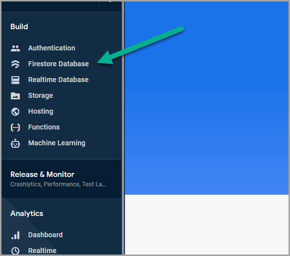
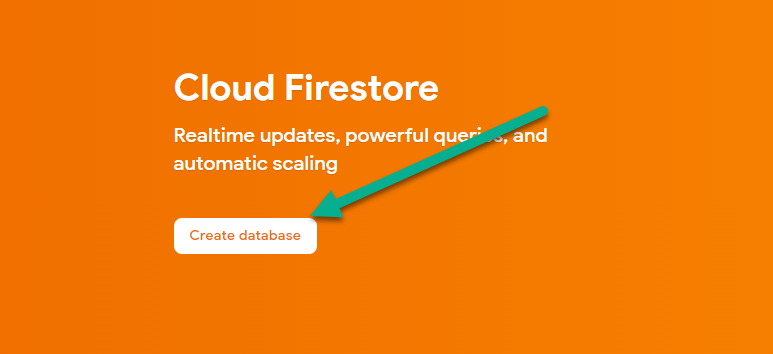
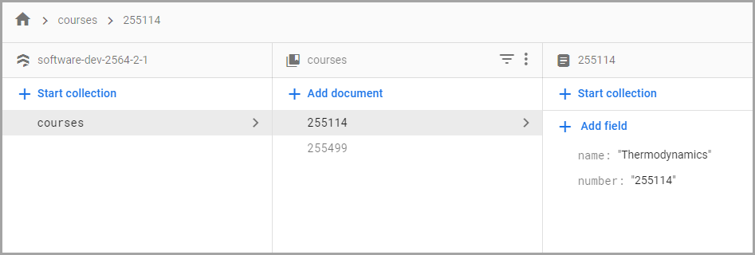

<style>
@import url('https://fonts.googleapis.com/css2?family=Prompt:ital,wght@0,100;0,300;0,400;0,700;1,100;1,300;1,400;1,700&display=swap');

:root {
    font-family: Prompt;
    --hl-color: #D57E7E;
}

h1 {
  font-family: Prompt;
}
</style>

# Web Application Development for Industrial Engineers

## การพัฒนาเวปแอปพลิเคชันสำหรับวิศวกรอุตสาหการ

---

# Firebase

---

# What is Googe Firebase?

- Google Firebase is a Google-backed application development software that enables developers to develop iOS, Android and Web apps.
- Services
  - **Database** (we will use this today.)
  - Cloud storage
  - Authentication
  - Cloud functions
  - And more...

---

# Get started

- https://firebase.google.com/



---

- Create a new project
  

---

- Turn off analytics
  

---

- Create `app`
  

---

- Any name is ok.
  

---

- Copy this information.
  

---

# Setup Local Development Environment

- Use the starter template.
- Install the existing libraries in `package.json`.

```
npm install
```

---

# Add `firebase` SDK.

```
npm install firebase
```

---

- Create `db.js`

```javascript
import { initializeApp } from 'firebase/app';
import { getFirestore } from 'firebase/firestore';

const firebaseConfig = {
  // Your config here
};

// Initialize Firebase
const app = initializeApp(firebaseConfig);

// Database object
const db = getFirestore();

console.log({ app, db });

export { db };
```

---

# Data Structure

- We will be using `Cloud Firestore`.
- Cloud Firestore is a NoSQL, document-oriented database.
- Unlike a SQL database, there are no tables or rows. Instead, you store data in `documents`, which are organized into `collections`.
- Let create some data.

---

- Go to `Cloud Firestore`
  

---

- Copy this information.
  

---

- Create data
  

---

# Read from database

```javascript
import { db } from './db';
import { collection, getDocs } from 'firebase/firestore';

getDocs(collection(db, 'courses')).then((querySnapshot) => {
  querySnapshot.forEach((doc) => {
    console.log(doc.id, doc.data());
  });
});
```

---

# Add data (1)

- Add a new document with a _generated_ id.

```javascript
import { db } from './db';
import { addDoc } from 'firebase/firestore';

const data = ...

addDoc(collection(db, 'courses'), data).then((docRef) => {
  console.log(`Successfully add doc ${docRef.id}`);
});
```

---

# Add data (2)

- Add a new document with a _specified_ id.

```javascript
import { db } from './db';
import { setDoc } from 'firebase/firestore';

const id = ...
const data = ...

setDoc(doc(db, 'courses', id), data).then(() => {
  console.log(`Successfully add doc ${id}`);
});
```

---

# Update data

```javascript
import { db } from './db';
import { setDoc, doc } from 'firebase/firestore';

const id = ...
const data = ...

setDoc(doc(db, 'courses', id), data, { merge: true }).then(() => {
  console.log(`Successfully update doc ${id}`);
});
```

---

# Delete data

```javascript
import { db } from './db';
import { doc, deleteDoc } from 'firebase/firestore';

const id = ...

deleteDoc(doc(db, 'courses', id)).then(() => {
  console.log(`Successfully delete doc ${id}`);
});
```
