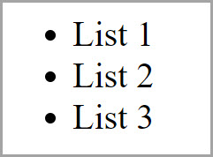
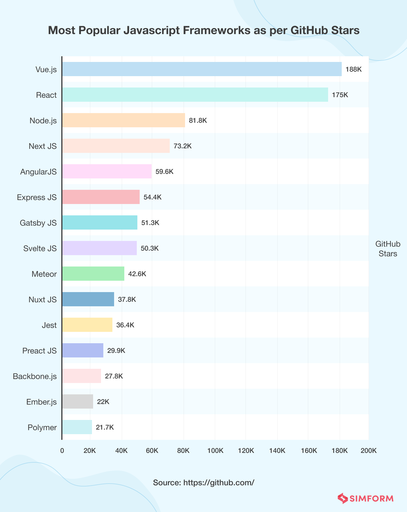

<style>
@import url('https://fonts.googleapis.com/css2?family=Prompt:ital,wght@0,100;0,300;0,400;0,700;1,100;1,300;1,400;1,700&display=swap');

:root {
    font-family: Prompt;
    --hl-color: #D57E7E;
}

h1 {
  font-family: Prompt;
}
</style>

# Web Application Development for Industrial Engineers

## การพัฒนาเวปแอปพลิเคชันสำหรับวิศวกรอุตสาหการ

---

# JavaScript Frameworks

---

# What is a framework?

- A framework is a library that offers **opinions** about how software gets built.
- These opinions allow for **predictability** and **homogeneity** in an application.
  - Predictability allows software to scale to an enormous size and still be maintainable.
  - Predictability and maintainability are essential for the health and longevity of software.

---

# Imperative and declarative programming

- **Imperative**
  - Tell a computer how to do something.
- **Declarative**
  - Describe to a computer what you want.

---

# To do this



---

# Imperative programming

- JavaScript

```javascript
const ul = document.createElement('ul');
for (let i = 1; i < 4; i++) {
  const li = document.createElement('li');
  li.textContent = `List ${i}`;
  ul.appendChild(li);
}
document.body.appendChild(ul);
```

---

# Declarative

- Just use HTML

```html
<ul>
  <li>List 1</li>
  <li>List 2</li>
  <li>List 3</li>
</ul>
```

---

# But...

- `HTML` only works for static site.
- For dynamic web application, a **framework** can help us write code more **declaratively**.

---

# Vanilla JS or Framework?

- Vanilla JS
  - A less complex site, for example a personal to-do list or a site that displays mostly static content
- Framework
  - A large site with a complex UI. Frameworks provide solutions to common problems that would take an absurd amount of time and patience to implement with pure JavaScript.

---

# The state of JavaScript frameworks 2022



---

# Job market

- https://th.jobsdb.com
- Try searching for `React`, `Vue`, `Angular`, ...

---

# React

---

# Concepts

- `JSX`
- Virtual DOM
- Rendering

### Source:

- https://reactjs.org/docs/introducing-jsx.html
- https://dev.to/teo_garcia/understanding-rendering-in-react-i5i

---

# Get started with `react`

https://reactjs.org/docs/create-a-new-react-app.html

```
npx create-react-app my-app
cd my-app
npm start
```

---

# Online IDE

https://codesandbox.io/
